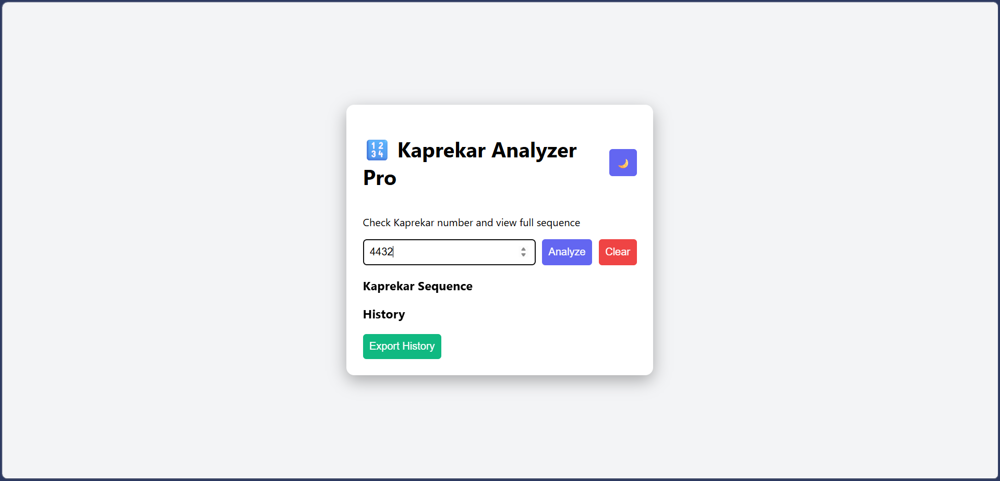
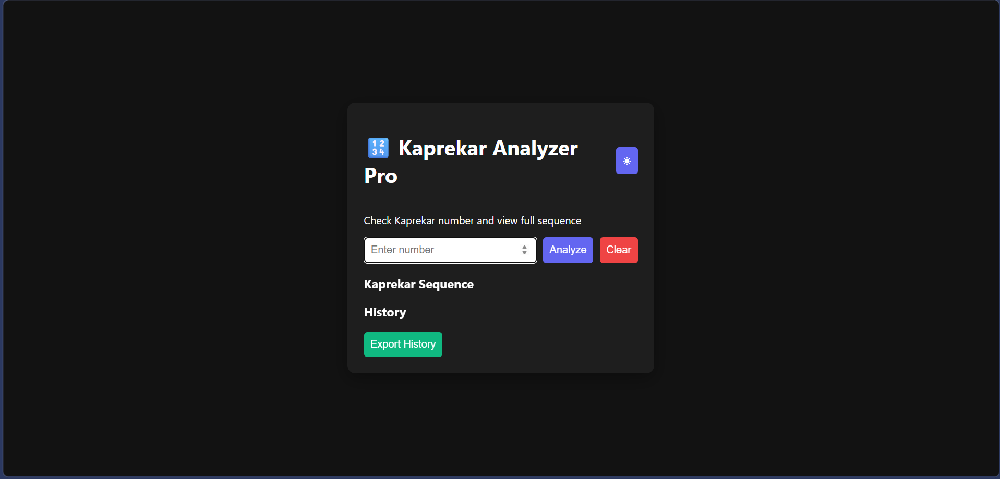
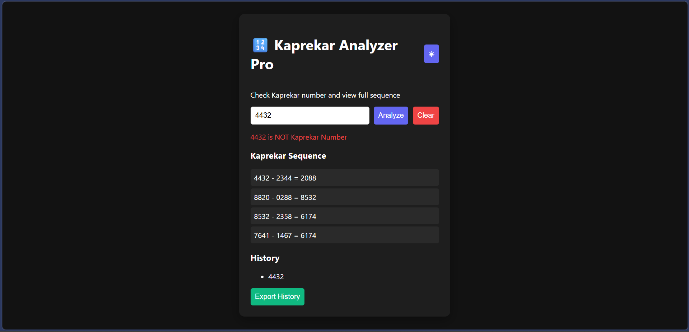

# 🔢 Kaprekar Number Analyzer Pro

An advanced interactive web application to analyze Kaprekar numbers, visualize Kaprekar sequences, and explore number theory concepts in a clean and modern UI.

🌐 Live Demo: https://yourusername.github.io/kaprekar-number-analyzer-pro/

---

## 🚀 Features

✔ Check whether a number is a Kaprekar number  
✔ Display full Kaprekar sequence (step-by-step routine)  
✔ Dark / Light mode toggle  
✔ Export history as a text file  
✔ Animated UI transitions  
✔ Mobile responsive design  
✔ Input validation & error handling  
✔ Real-time interaction  

---

## 🧮 What is a Kaprekar Number?

A number **K** is called a Kaprekar number if:

1. Compute K²  
2. Split the square into two parts  
3. If the sum of those parts equals K, it is a Kaprekar number  

Example:

```
45² = 2025  
20 + 25 = 45  
```

So, **45 is a Kaprekar number.**

---

## 🔄 Kaprekar Routine (Sequence)

This project also visualizes the Kaprekar sequence by:

1. Rearranging digits in ascending order  
2. Rearranging digits in descending order  
3. Subtracting smaller from larger  
4. Repeating until a loop or constant appears  

---

## 🖼 Screenshots

### 🌞 Light Mode


### 🌙 Dark Mode


### 🔁 Kaprekar Sequence Output


---

## 🛠 Technologies Used

- HTML5  
- CSS3 (Flexbox, animations, gradients)  
- Vanilla JavaScript (DOM manipulation, logic handling)  

---

## 📂 Project Structure

```
kaprekar-number-analyzer-pro/
│
├── index.html
├── style.css
├── script.js
├── screenshots/
│   ├── ui.png
│   ├── dark.png
│   └── sequence.png
└── README.md
```

---

## ▶ How to Run Locally

1. Clone the repository:

```
git clone https://github.com/yourusername/kaprekar-number-analyzer-pro.git
```

2. Open the folder  
3. Double-click `index.html`  

No additional installation required.

---

## 📤 Export Feature

Users can export their analyzed number history as:

```
kaprekar-history.txt
```

This makes the project more practical and user-friendly.

---

## 🎨 UI Highlights

- Smooth fade-in animation  
- Modern card-based layout  
- Gradient backgrounds  
- Dark mode toggle with dynamic theme switch  
- Responsive layout for mobile screens  

---

## 📱 Responsive Design

The application adapts to:

- Desktop  
- Tablet  
- Mobile devices  

Using flexible layout and max-width styling.

---

## 🎯 Future Improvements

- Add Kaprekar constant explanation  
- Add unit tests  
- Add user statistics  
- Deploy on Netlify / Vercel  

---

## 👨‍💻 Author

Dixant Soni  

---

## 📜 License

This project is developed for educational and demonstration purposes.

---

⭐ If you like this project, consider giving it a star!
